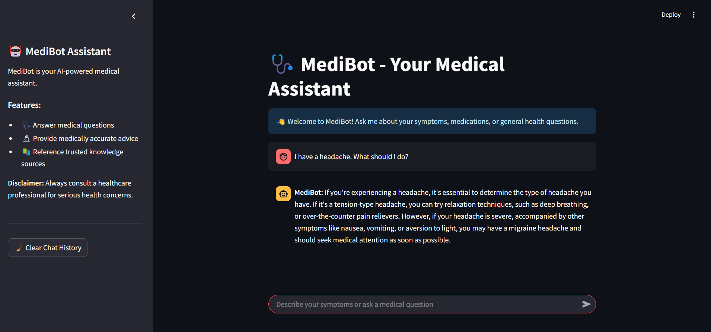

## MediBot - AI-Powered Medical Assistant
# MediBot 🤖🩺
Your Personalized AI Medical Assistant 

MediBot is an advanced AI-based medical assistant designed to help you with health-related queries, symptoms, and general medical advice. It uses state-of-the-art machine learning models and an extensive knowledge base to provide accurate, reliable, and context-aware responses.

#### Key Features
**Symptom Analysis**: Get quick responses to your symptoms or health-related questions.
**Medical Knowledge Retrieval:** Powered by a FAISS vector store and embeddings for precise information retrieval.
**AI-Powered Conversations:** Utilizes advanced LLM (Large Language Model) to generate context-aware and accurate responses.
**Buffer Memory:** Remembers previous interactions for a more personalized and conversational experience.
**Interactive UI:** Built with Streamlit for an intuitive and seamless user experience.

#### How It Works
**Embeddings:** Converts medical data into embeddings using sentence-transformers/all-MiniLM-L6-v2.
**Knowledge Base:** Queries the FAISS vector store to find the most relevant information.
**Prompting:** A custom prompt ensures medically precise and context-aware answers.
**Conversation Memory:** Uses buffer memory to maintain a natural conversation flow.

#### Requirements
Before running MediBot, ensure you have the following installed:

Python 3.8+
Streamlit
FAISS
LangChain
HuggingFace Transformers
Groq LLM API Access

#### Usage
**1.** Open the app in your browser.
**2.** Type your symptoms or health-related questions in the chat input box.
**3.** MediBot will analyze your query and respond with accurate medical advice.
**4.** Use the sidebar to reset chat history when needed.

#### result

#### Project Structure

medibot/
├── app.py                 # Main application logic
|__ creating_memory     # embedding and store in faiss           
├── requirements.txt       # Required Python libraries
├── vectorstore/           # Folder for FAISS vector database
│   └── db_faiss           # Medical knowledge base
└── README.md              # Documentation file

##### Disclaimer
MediBot is an AI tool designed to assist with general medical queries. It is NOT a substitute for professional medical advice, diagnosis, or treatment. Always consult a healthcare professional for serious concerns.

#### Future Development
Voice Interaction: Add voice-based input and output.
Multilingual Support: Enable the chatbot to support multiple languages.
Authentication: Allow user login for personalized conversations.
Enhanced Knowledge Base: Expand the database with more up-to-date medical resources.

#### License
This project is open-source under the MIT License.

🤖🩺